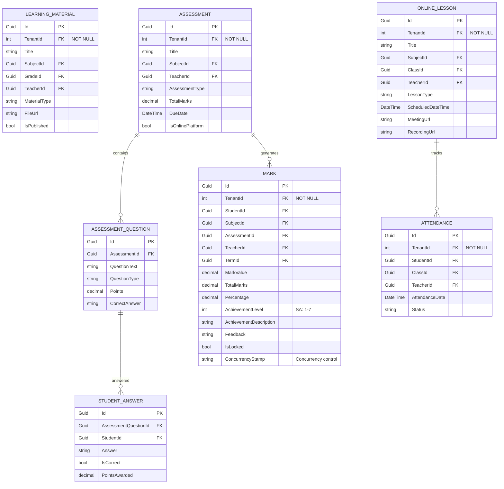
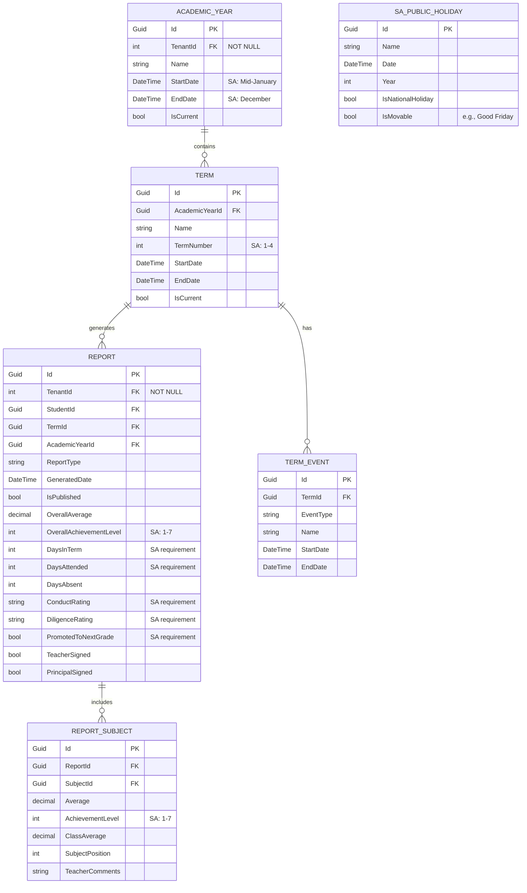
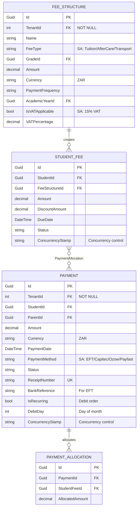
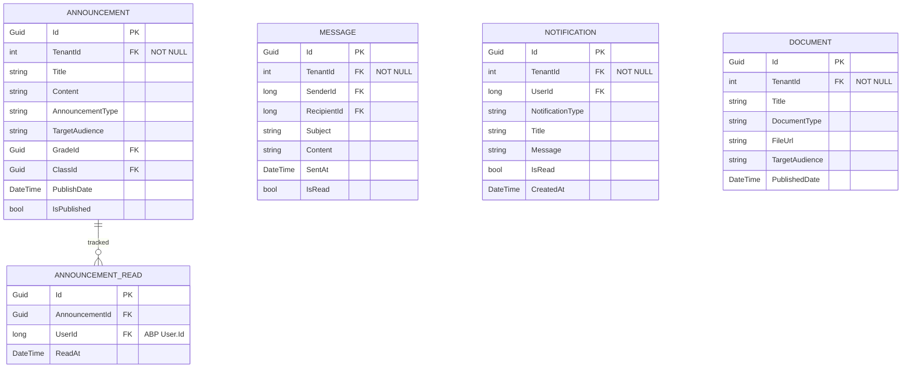
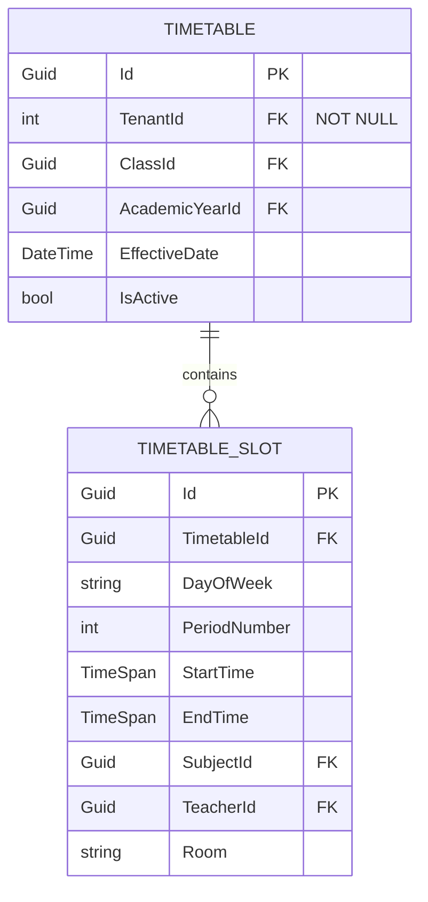
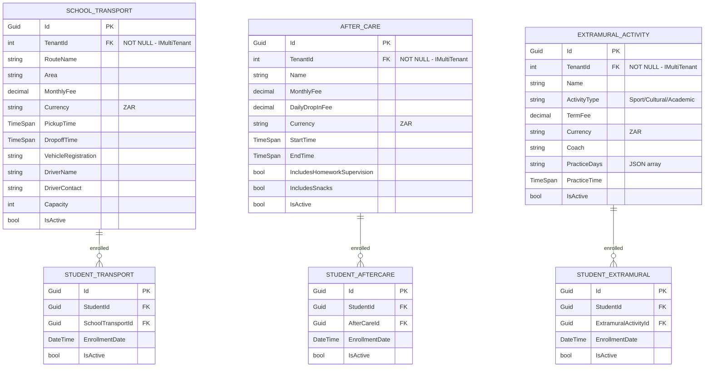
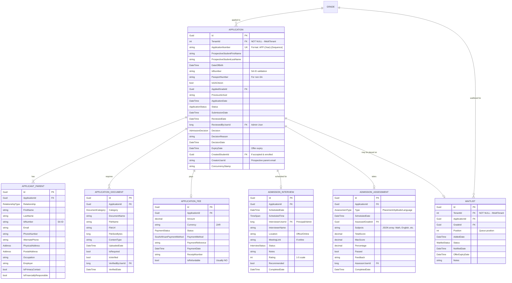

# PSMS Entity Relationship Diagram (CORRECTED & ALIGNED)
## South African Private School Management System

**ABP Framework | Multi-Tenancy | DDD Patterns**

---

## Core Domain Model Visualization

```mermaid
erDiagram
    TENANT ||--o{ STUDENT : "has"
    TENANT ||--o{ TEACHER : "employs"
    TENANT ||--o{ PARENT : "has"
    TENANT ||--o{ GRADE : "offers"
    TENANT ||--o{ SUBJECT : "teaches"
    TENANT ||--o{ ACADEMIC_YEAR : "operates"
    TENANT ||--o{ SCHOOL_TRANSPORT : "provides"
    TENANT ||--o{ AFTER_CARE : "offers"
    TENANT ||--o{ EXTRAMURAL_ACTIVITY : "manages"
    TENANT ||--o{ APPLICATION : "receives"

    APPLICATION }o--|| GRADE : "applies to"
    APPLICATION ||--|{ APPLICANT_PARENT : "from"
    APPLICATION ||--o{ APPLICATION_DOCUMENT : "requires"
    APPLICATION ||--o| APPLICATION_FEE : "pays"
    APPLICATION ||--o| ADMISSION_INTERVIEW : "may have"
    APPLICATION ||--o| ADMISSION_ASSESSMENT : "may take"
    APPLICATION ||--o| WAITLIST : "may be on"
    APPLICATION }o--o| STUDENT : "converts to (if accepted)"

    STUDENT }o--|| GRADE : "enrolled in"
    STUDENT }o--|| CLASS : "belongs to"
    STUDENT }o--o{ PARENT : "linked through StudentParent"
    STUDENT }o--o{ SUBJECT : "enrolled through StudentSubject"
    STUDENT ||--o{ MARK : "receives"
    STUDENT ||--o{ ATTENDANCE : "has"
    STUDENT ||--o{ REPORT : "receives"
    STUDENT ||--o{ PAYMENT : "associated with"
    STUDENT ||--o{ STUDENT_FEE : "assigned"
    STUDENT ||--o{ POPIA_CONSENT : "has"

    PARENT ||--o{ PAYMENT : "makes"

    TEACHER }o--o{ SUBJECT : "teaches through TeacherSubject"
    TEACHER }o--o{ CLASS : "teaches through TeacherClass"
    TEACHER ||--o{ LEARNING_MATERIAL : "uploads"
    TEACHER ||--o{ ONLINE_LESSON : "conducts"
    TEACHER ||--o{ ASSESSMENT : "creates"
    TEACHER ||--o{ MARK : "assigns"
    TEACHER ||--o{ ATTENDANCE : "records"

    GRADE ||--o{ CLASS : "contains"
    GRADE }o--o{ SUBJECT : "offers through GradeSubject"

    CLASS }o--|| ACADEMIC_YEAR : "operates in"
    CLASS ||--o{ TIMETABLE : "has"
    CLASS ||--o{ ANNOUNCEMENT : "receives"

    SUBJECT ||--o{ LEARNING_MATERIAL : "has"
    SUBJECT ||--o{ ASSESSMENT : "has"
    SUBJECT ||--o{ MARK : "for"
    SUBJECT ||--o{ ONLINE_LESSON : "delivered in"

    ACADEMIC_YEAR ||--o{ TERM : "divided into"
    ACADEMIC_YEAR ||--o{ FEE_STRUCTURE : "has"

    TERM ||--o{ TERM_EVENT : "contains"
    TERM ||--o{ MARK : "recorded in"
    TERM ||--o{ REPORT : "generated for"

    ASSESSMENT ||--o{ ASSESSMENT_QUESTION : "contains"
    ASSESSMENT ||--o{ MARK : "generates"

    ASSESSMENT_QUESTION ||--o{ STUDENT_ANSWER : "answered by"

    ONLINE_LESSON ||--o{ ATTENDANCE : "tracks"

    REPORT ||--o{ REPORT_SUBJECT : "contains"
    REPORT_SUBJECT }o--|| SUBJECT : "for"

    FEE_STRUCTURE ||--o{ STUDENT_FEE : "assigned as"

    STUDENT_FEE }o--o{ PAYMENT : "paid through PaymentAllocation"

    ANNOUNCEMENT ||--o{ ANNOUNCEMENT_READ : "tracked by"

    TIMETABLE ||--o{ TIMETABLE_SLOT : "contains"
```

---

## Detailed Module Relationships

### 1. Academic Management Core (SA Context)

```mermaid
erDiagram
    STUDENT {
        Guid Id PK
        int TenantId FK "NOT NULL - IMultiTenant"
        string FirstName
        string LastName
        DateTime DateOfBirth
        string IdNumber "SA ID with validation"
        string PassportNumber "For non-SA students"
        bool IsSACitizen
        string AdmissionNumber UK
        Guid CurrentGradeId FK
        Guid CurrentClassId FK
        bool IsActive
        bool POPIAConsentGiven "POPIA compliance"
        DateTime POPIAConsentDate
        bool AllowPhotography
        string ConcurrencyStamp
    }

    PARENT {
        Guid Id PK
        int TenantId FK "NOT NULL - IMultiTenant"
        long UserId FK "ABP User.Id is long"
        string FirstName
        string LastName
        string Email
        string Phone
        string IdNumber "SA ID"
        string Relationship
        bool IsPrimaryContact
    }

    TEACHER {
        Guid Id PK
        int TenantId FK "NOT NULL - IMultiTenant"
        long UserId FK "ABP User.Id is long"
        string FirstName
        string LastName
        string Email
        string EmployeeNumber UK
        DateTime DateOfJoining
        bool IsActive
    }

    GRADE {
        Guid Id PK
        int TenantId FK "NOT NULL - IMultiTenant"
        string Name
        string Code
        int GradeLevel "SA: R-12"
        string SchoolPhase "Foundation/Intermediate/Senior/FET"
        int SortOrder
        bool IsActive
    }

    CLASS {
        Guid Id PK
        int TenantId FK "NOT NULL - IMultiTenant"
        Guid GradeId FK
        string Name
        int Capacity
        Guid ClassTeacherId FK
        Guid AcademicYearId FK
        bool IsActive
    }

    SUBJECT {
        Guid Id PK
        int TenantId FK "NOT NULL - IMultiTenant"
        string Name
        string Code
        bool IsCore
        bool IsLanguage "SA: 11 official languages"
        string LanguageType "Home/First Additional"
        bool IsCAPSCompliant "SA curriculum"
        bool IsActive
    }

    STUDENT_PARENT {
        Guid Id PK
        Guid StudentId FK
        Guid ParentId FK
        string RelationshipType
        bool IsPrimaryContact
        bool CanMakePayments
        bool CanViewAcademicRecords
    }

    STUDENT_SUBJECT {
        Guid Id PK
        Guid StudentId FK
        Guid SubjectId FK
        Guid AcademicYearId FK
        DateTime EnrollmentDate
        bool IsActive
    }

    POPIA_CONSENT {
        Guid Id PK
        int TenantId FK "NOT NULL - IMultiTenant"
        Guid StudentId FK
        long UserId FK
        DateTime ConsentDate
        bool MarketingConsent
        bool DataSharingConsent
        bool PhotographyConsent
        string ConsentVersion
        bool IsActive
    }

    STUDENT }o--o{ PARENT : "StudentParent"
    STUDENT }o--|| GRADE : "enrolled"
    STUDENT }o--|| CLASS : "assigned"
    STUDENT }o--o{ SUBJECT : "StudentSubject"
    STUDENT ||--o{ POPIA_CONSENT : "has"
    CLASS }o--|| GRADE : "belongs"
    CLASS }o--|| TEACHER : "class teacher"
    TEACHER }o--o{ SUBJECT : "TeacherSubject"
    TEACHER }o--o{ CLASS : "TeacherClass"
    GRADE }o--o{ SUBJECT : "GradeSubject"
```

### 2. Learning & Assessment Module (SA Grading)



### 3. Reporting Module (SA Report Cards)



### 4. Financial Module (SA Context)



### 5. Communication Module



### 6. Timetable Module



### 7. SA-Specific Entities



---

## 9. Admissions Module (SA School Application Process)



### Application Workflow States
```csharp
public enum ApplicationStatus
{
    Draft = 1,              // Parent creating application
    Submitted = 2,          // Submitted, awaiting payment
    PaymentPending = 3,     // Awaiting application fee payment
    UnderReview = 4,        // Admin reviewing application
    DocumentsRequired = 5,  // Missing required documents
    InterviewScheduled = 6, // Interview booked
    AssessmentScheduled = 7,// Placement test scheduled
    UnderConsideration = 8, // All done, awaiting decision
    Approved = 9,           // Admission granted
    Rejected = 10,          // Application declined
    Waitlisted = 11,        // Placed on waitlist
    Expired = 12,           // Offer/application expired
    Withdrawn = 13,         // Parent withdrew
    Enrolled = 14           // Converted to student
}

public enum AdmissionDecision
{
    Pending = 1,
    Accepted = 2,
    AcceptedWithConditions = 3,
    Rejected = 4,
    Waitlisted = 5
}

public enum DocumentCategory
{
    BirthCertificate = 1,
    IDDocument = 2,
    Passport = 3,
    PreviousReportCard = 4,
    TransferLetter = 5,
    ImmunizationRecord = 6,
    MedicalCertificate = 7,
    ProofOfResidence = 8,
    ParentID = 9,
    PassportPhoto = 10,
    Other = 99
}

public enum InterviewStatus
{
    Scheduled = 1,
    Rescheduled = 2,
    Completed = 3,
    Cancelled = 4,
    NoShow = 5
}

public enum WaitlistStatus
{
    Active = 1,
    Offered = 2,      // Position available, offer sent
    Accepted = 3,     // Offer accepted
    Declined = 4,     // Offer declined
    Expired = 5,      // Offer expired
    Withdrawn = 6     // Removed from waitlist
}
```

### Business Rules - Admissions Module
1. Application Number format: `APP-{TenantId}-{Year}-{Sequence}`
2. Application fee must be paid before review begins
3. At least one parent/guardian required per application
4. Birth certificate or passport required (SA students must have ID number)
5. Previous school report card required for Grades 2-12
6. Interview is optional (configurable per school/grade)
7. Assessment is optional (configurable per school/grade)
8. Admission capacity limits per grade enforced
9. Waitlist position automatic based on application date (FIFO)
10. Acceptance offer expires after 14 days (configurable)
11. Application expires after 12 months if no decision made
12. Once accepted and enrolled, Application.CreatedStudentId links to Student entity

---

## Value Objects (DDD Pattern)

### Address Value Object
```csharp
public class Address : ValueObject
{
    public string StreetAddress { get; private set; }
    public string Suburb { get; private set; }
    public string City { get; private set; }
    public string Province { get; private set; }  // SA Provinces
    public string PostalCode { get; private set; }
    public string Country { get; private set; } = "South Africa";

    protected override IEnumerable<object> GetAtomicValues()
    {
        yield return StreetAddress;
        yield return Suburb;
        yield return City;
        yield return Province;
        yield return PostalCode;
        yield return Country;
    }
}
```

### Money Value Object
```csharp
public class Money : ValueObject
{
    public decimal Amount { get; private set; }
    public string Currency { get; private set; } = "ZAR";

    protected override IEnumerable<object> GetAtomicValues()
    {
        yield return Amount;
        yield return Currency;
    }
}
```

### SouthAfricanIdNumber Value Object
```csharp
public class SouthAfricanIdNumber : ValueObject
{
    public string Value { get; private set; }

    // Constructor with validation (Luhn algorithm)
    // Methods: GetDateOfBirth(), GetGender(), IsCitizen()

    protected override IEnumerable<object> GetAtomicValues()
    {
        yield return Value;
    }
}
```

---

## South African Enumerations

### Academic Enums (SA Context)
```csharp
// SA Grade Levels
public enum SouthAfricanGradeLevel
{
    GradeR = 0,
    Grade1 = 1,
    Grade2 = 2,
    Grade3 = 3,
    Grade4 = 4,
    Grade5 = 5,
    Grade6 = 6,
    Grade7 = 7,
    Grade8 = 8,
    Grade9 = 9,
    Grade10 = 10,
    Grade11 = 11,
    Grade12 = 12
}

// SA School Phases
public enum SouthAfricanSchoolPhase
{
    Foundation = 1,      // Grade R-3
    Intermediate = 2,    // Grade 4-6
    Senior = 3,          // Grade 7-9
    FET = 4              // Grade 10-12
}

// SA 7-Level Achievement Scale
public enum SouthAfricanAchievementLevel
{
    Level1_NotAchieved = 1,      // 0-29%
    Level2_Elementary = 2,        // 30-39%
    Level3_Moderate = 3,          // 40-49%
    Level4_Adequate = 4,          // 50-59%
    Level5_Substantial = 5,       // 60-69%
    Level6_Meritorious = 6,       // 70-79%
    Level7_Outstanding = 7        // 80-100%
}

// SA Term Numbers
public enum SouthAfricanTermNumber
{
    Term1 = 1,  // Jan-Mar
    Term2 = 2,  // Apr-Jun
    Term3 = 3,  // Jul-Sep
    Term4 = 4   // Oct-Dec
}

// Standard enums
public enum Gender { Male, Female, Other }
public enum RelationshipType { Mother, Father, Guardian, Other }
public enum MaterialType { PDF, Video, Slide, Link, Other }
public enum LessonType { Scheduled, Live, Recorded }
public enum AssessmentType { Quiz, Test, Exam, Assignment, Practical }
public enum QuestionType { MultipleChoice, TrueFalse, ShortAnswer, Essay }
public enum AttendanceStatus { Present, Absent, Late, Excused }
public enum ReportType { TermReport, MidTermReport, FinalReport, ProgressReport }
public enum EventType { Holiday, Exam, SchoolEvent, PublicHoliday, Other }
```

### Financial Enums (SA Context)
```csharp
// SA Fee Types
public enum SouthAfricanFeeType
{
    AnnualTuition = 1,
    MonthlyTuition = 2,
    Registration = 3,
    AdmissionFee = 4,
    Textbooks = 5,
    Stationery = 6,
    Uniform = 7,
    SchoolTrips = 8,
    Extramurals = 9,
    Transport = 10,
    AfterCare = 11,
    ComputerLevy = 12,
    BuildingFund = 13,
    InsuranceCover = 14
}

// SA Payment Methods
public enum SouthAfricanPaymentMethod
{
    Cash = 1,
    EFT = 2,
    DebitOrder = 3,
    CreditCard = 4,
    Capitec = 5,
    SnapScan = 6,
    Zapper = 7,
    Yoco = 8,
    Payfast = 9,
    Ozow = 10,
    DirectDeposit = 11,
    Cheque = 12
}

// Payment Plans
public enum PaymentPlan
{
    AnnualUpfront = 1,
    Quarterly = 2,
    Monthly = 3,
    MonthlyDebitOrder = 4
}

// Standard enums
public enum FeeStatus { Pending, Paid, PartiallyPaid, Overdue, Waived }
public enum PaymentStatus { Pending, Completed, Failed, Refunded }
```

### Communication Enums
```csharp
public enum AnnouncementType { General, Academic, Event, Urgent, Other }
public enum TargetAudience { School, Grade, Class, Parents, Teachers, Students, All }
public enum NotificationType { Report, Payment, Announcement, Message, Other }
public enum DocumentType { Policy, Handbook, Form, Other }
public enum DayOfWeek { Monday, Tuesday, Wednesday, Thursday, Friday, Saturday, Sunday }
```

### SA-Specific Enums
```csharp
public enum ExtramuralType { Sport, Cultural, Academic }
```

---

## Key Junction Tables

### StudentParent
Links students to their parents/guardians with SA-specific relationship management.

### StudentSubject
Enrolls students in subjects for an academic year (CAPS curriculum).

### StudentTransport
Links students to school transport routes (very common in SA).

### StudentAfterCare
Links students to aftercare programs (very common in SA).

### StudentExtramural
Links students to extramural activities (sport, cultural, academic).

### TeacherSubject
Assigns teachers to subjects they teach in specific grades.

### TeacherClass
Assigns teachers to classes for specific subjects.

### GradeSubject
Defines which subjects are offered in which grades (CAPS alignment).

### PaymentAllocation
Allocates payment amounts to specific student fees.

---

## Domain Model Statistics

- **Total Entities**: 49 (was 42)
- **Aggregate Roots**: 26 (was 25) - Added: Application
- **Child Entities**: 16 (was 11) - Added: ApplicantParent, ApplicationDocument, ApplicationFee, AdmissionInterview, AdmissionAssessment
- **Junction Tables**: 9
- **Value Objects**: 3
- **Enumerations**: 30+ (was 25+) - Added: ApplicationStatus, AdmissionDecision, DocumentCategory, InterviewStatus, WaitlistStatus
- **Modules**: 7 main modules (was 6) - Added: Admissions Module
- **SA-Specific Entities**: 7

---

## ABP Multi-Tenancy Implementation

### Critical Rules:
1. ✅ **TenantId is `int?` (nullable int)** - NOT Guid!
2. ✅ **UserId is `long`** - NOT Guid! (ABP User.Id is long)
3. ✅ All tenant-scoped entities implement `IMultiTenant`
4. ✅ ABP automatically filters queries by TenantId
5. ✅ Junction tables inherit tenant from parent entities
6. ✅ SouthAfricanPublicHoliday is Host-level (no TenantId)

### Multi-Tenant Entities (IMultiTenant):
```
Student, Parent, Teacher, Grade, Class, Subject,
AcademicYear, LearningMaterial, OnlineLesson, Assessment,
Mark, Attendance, Report, FeeStructure, Payment, StudentFee,
Announcement, Message, Notification, Document, Timetable,
SchoolTransport, AfterCare, ExtramuralActivity, POPIAConsent,
Application, Waitlist
```

### Host-Level Entities (No IMultiTenant):
```
SouthAfricanPublicHoliday (shared across all schools)
```

---

## Database Indexes (Performance)

### Critical Indexes:
```sql
-- Student
CREATE INDEX IX_Students_TenantId ON Students(TenantId);
CREATE UNIQUE INDEX IX_Students_AdmissionNumber ON Students(TenantId, AdmissionNumber);
CREATE INDEX IX_Students_CurrentGradeId ON Students(CurrentGradeId);
CREATE INDEX IX_Students_CurrentClassId ON Students(CurrentClassId);

-- Teacher
CREATE INDEX IX_Teachers_TenantId ON Teachers(TenantId);
CREATE UNIQUE INDEX IX_Teachers_EmployeeNumber ON Teachers(TenantId, EmployeeNumber);
CREATE INDEX IX_Teachers_UserId ON Teachers(UserId);

-- Mark (heavily queried)
CREATE INDEX IX_Marks_TenantId ON Marks(TenantId);
CREATE INDEX IX_Marks_StudentId_TermId ON Marks(StudentId, TermId);
CREATE INDEX IX_Marks_SubjectId_TermId ON Marks(SubjectId, TermId);

-- Payment
CREATE INDEX IX_Payments_TenantId ON Payments(TenantId);
CREATE UNIQUE INDEX IX_Payments_ReceiptNumber ON Payments(TenantId, ReceiptNumber);
CREATE INDEX IX_Payments_StudentId ON Payments(StudentId);
CREATE INDEX IX_Payments_PaymentDate ON Payments(PaymentDate);

-- Application (Admissions)
CREATE INDEX IX_Applications_TenantId ON Applications(TenantId);
CREATE UNIQUE INDEX IX_Applications_ApplicationNumber ON Applications(TenantId, ApplicationNumber);
CREATE INDEX IX_Applications_Status ON Applications(Status);
CREATE INDEX IX_Applications_AppliedGradeId ON Applications(AppliedGradeId);
CREATE INDEX IX_Applications_ApplicationDate ON Applications(ApplicationDate);
CREATE INDEX IX_Applications_DecisionDate ON Applications(DecisionDate);

-- Waitlist
CREATE INDEX IX_Waitlist_TenantId ON Waitlist(TenantId);
CREATE INDEX IX_Waitlist_GradeId_Status ON Waitlist(GradeId, Status);
CREATE INDEX IX_Waitlist_Position ON Waitlist(Position);

-- All IMultiTenant entities need TenantId index
```

---

## ABP Implementation Notes

1. **Multi-Tenancy**: Each school = One tenant; Platform = Host
2. **Data Types**: `int? TenantId`, `long UserId` (ABP standards)
3. **Aggregate Roots**: Inherit from `FullAuditedAggregateRoot<Guid>, IMultiTenant`
4. **Child Entities**: Inherit from `Entity<Guid>` or `CreationAuditedEntity<Guid>`
5. **Soft Delete**: Automatic via ABP's `ISoftDelete`
6. **Audit Logging**: Automatic via ABP's auditing system
7. **Data Filtering**: Automatic tenant filtering via `IMultiTenant`
8. **Concurrency**: Use `ConcurrencyStamp` on Payment, Mark, StudentFee
9. **Value Objects**: Address, Money, SouthAfricanIdNumber
10. **SA Context**: All SA-specific enums, entities, validations included

---

## POPIA Compliance (SA Data Protection)

- POPIAConsent entity tracks consent
- Student.POPIAConsentGiven flag
- Photography consent tracking
- Data retention policies
- Right to be forgotten support

---

## Key Business Rules

1. Students must be assigned to a Grade and Class
2. Marks cannot be edited once locked
3. Parents must be linked to at least one Student
4. Teachers must be assigned to Subjects and Classes they teach
5. Reports can only be published once all marks are locked
6. Payments must be allocated to specific fees
7. Academic Year - only one can be current at a time (per tenant)
8. Term - only one can be current per academic year
9. Fee structures must be defined before assigning to students
10. Attendance can only be taken by assigned teacher
11. SA ID numbers must pass Luhn validation
12. POPIA consent required before storing student data
13. VAT handling for registered schools (15%)
14. 4-term academic year (SA standard)
15. 7-level achievement grading (SA CAPS)

---

**Document Version**: 2.0 (Corrected & Aligned)
**Last Updated**: 2026-01-27
**Framework**: ASP.NET Boilerplate (ABP)
**Target**: South African Private Schools
